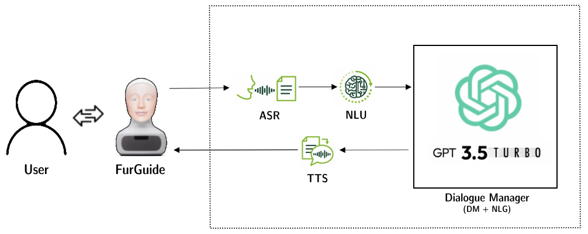
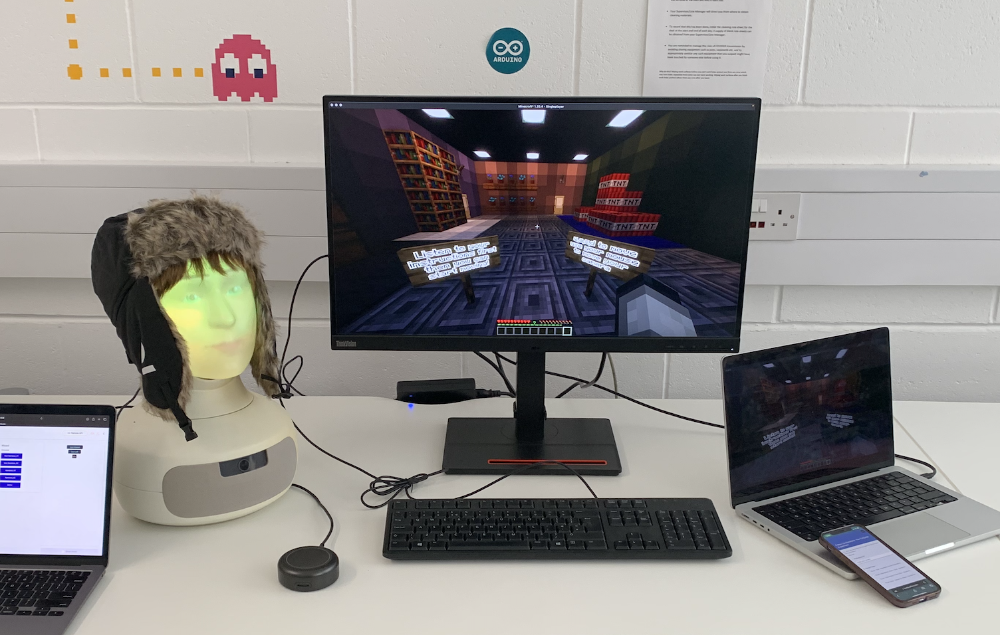
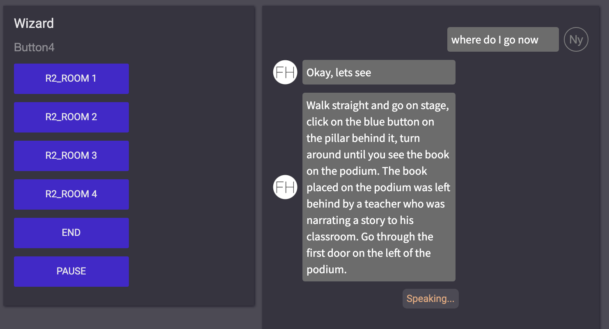
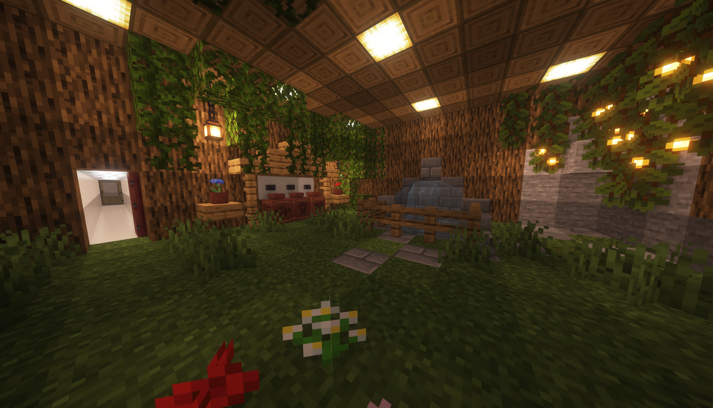

# FurGuide: Enhancing User Experience with Narrative-Based Interaction

## Project Contributors

- Omar Riyaz @omarriyaz
- Shivaanee Eswaran @shivaanee

## Project Overview

This project/study explores how user experience and recall during instruction-following tasks in a virtual environment can be improved through narrative-based interaction with FurGuide, an expressive social robot. We aimed to evaluate whether embedding storytelling elements into FurGuide's guidance system enhances user recall, task performance, and engagement.

## What We Did

### Objective

We investigated the impact of narrative-based interaction on:

- **User Recall**: Memory and usage of provided instructions.
- **Task Performance**: Accuracy in following navigation and task instructions.
- **Engagement**: User satisfaction and involvement.

Participants interacted with FurGuide while navigating a Minecraft map, with FurGuide providing instructions in two formats:

1. **Narrative Condition**: Instructions with integrated storytelling elements.
2. **Non-Narrative Condition**: Instructions without narrative support.

### System Design

Our experimental setup included:

- **FurGuide**: A social robot powered by OpenAI’s GPT-3.5 Turbo model.
- **Minecraft Environment**: A maze-like virtual world built in Minecraft used for tasks.
- **Equipment**: Two laptops, a microphone, and a monitoring system.

#### Key Components:

- **Automatic Speech Recognition (ASR)**: Used Google Cloud Speech-to-Text for converting speech to text.
- **Natural Language Understanding (NLU)**: Interpreted user input and managed dialogue flow.
- **Dialogue Management (DM)**: Utilized GPT-3.5 Turbo for generating natural responses.
- **Prompt Engineering**: Provided specific instructions to guide the conversation and minimize errors.
- **Text-to-Speech (TTS)**: Employed Amazon Polly for converting text responses into speech.

### Implementation

The experiment was conducted with the following steps:

1. **Setup**: Two laptops were used—one for running Minecraft and collecting participant data, and the other for running FurGuide's code and managing the Wizarding Interface.

2. **Procedure**:
   - Participants were briefed and completed pre-experiment questionnaires.
   - They navigated through the Minecraft map with FurGuide providing guidance.
   - Performance was monitored, and post-task questionnaires were collected.

3. **Coding**:
   - **Kotlin**: The FurGuide system was coded in Kotlin to handle dialogue management and interaction with the Furhat robot.
   - **Prompt Engineering**: Prompts were carefully designed to instruct GPT-3.5 Turbo on providing detailed navigational assistance and handling user queries effectively. For instance, prompts included specific room details and tasks to ensure accurate responses.
   - **System Integration**: The Kotlin code integrated various components like ASR, NLU, and TTS to create a seamless user experience.

## Demonstration

## Results

We addressed the following research questions:

1. **RQ1**: Effect of narratives on recall, usefulness, and accuracy.
2. **RQ2**: Effect of narratives on follow-up questions.
3. **RQ3**: Effect of narratives on FurGuide's likeability and anthropomorphism.

**Findings**:

- **RQ1 and RQ2**: Narrative impact on recall and task performance was statistically insignificant.
- **RQ3**: The narrative condition increased FurGuide's likeability and perceived anthropomorphism.

## Limitations

- **Sample Size**: Only 24 participants were involved, which was below the threshold for statistical significance.
- **Demographics**: The majority of participants were international students, leading to potential variability in language proficiency.

## Future Work

Future studies should:

- Increase sample size for more reliable results.
- Include a diverse participant pool to enhance generalizability.

## Conclusion

Our study highlights the potential benefits of incorporating narratives into human-robot interactions, particularly in enhancing robot likeability and anthropomorphism. Although recall and task performance improvements were not statistically significant, the findings suggest that narrative elements can positively influence user experience.

For more details, refer to the full study and system demo.
